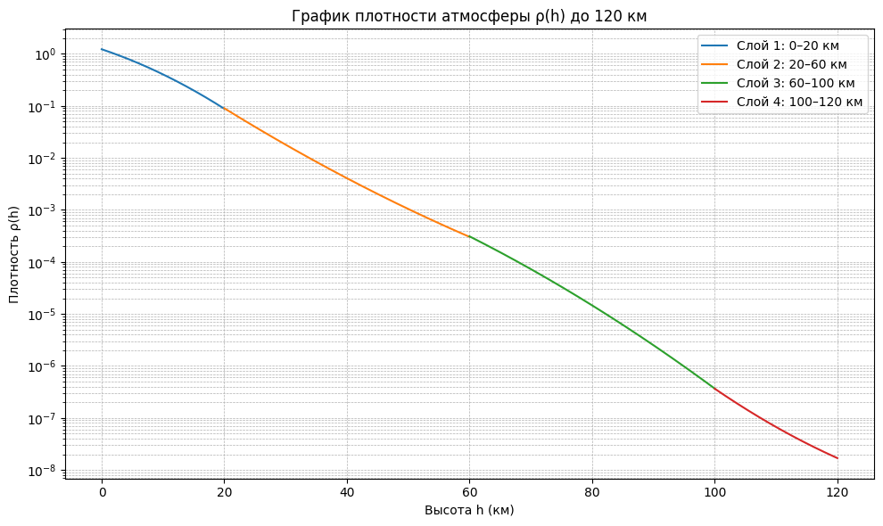

---

## Ключевые источники

| Название | Тип | Год | Ключевая мысль | Что использовать? | Ссылка |
|:---------|:---:|:---:|:---------------|:------------------|:-------|
| <a href="#gost-25645-166-2004">ГОСТ Р 25645.166-2004</a> | Стандарт | 2004 | Детерминированная модель плотности для баллистики ИСЗ: `ρ = f(h, F10.7, Ap)`. Основа для бенчмарка. | Формулы, алгоритм. Диапазоны применимости. | [PDF] |
|  <a href="#nrlmsis">NLMSISE-00* (Picone et al.) | Модель | 2002 | Эмпирическая модель атмосферы. Фактический стандарт в науке. Учитывает больше эффектов, чем ГОСТ. | Как эталон для сравнения. Исходный код. | [Сайт] |
|  <a href="#nrlmsis">NLMSISE-2.0* | Модель | 2022 | Эмпирическая модель атмосферы. Фактический стандарт в науке. Учитывает больше эффектов, чем ГОСТ. | Как эталон для сравнения. Исходный код. | [Сайт] || | | | | | |
| | | | | | |

---

## Статьи и методы

| Название | Тип | Год | Ключевая мысль | Что использовать? | Ссылка |
|:---------|:---:|:---:|:---------------|:------------------|:-------|
|<a href="#DDCM">DDCM</a>  | | | | | |
|<a href="#HASDM">HASDM</a>  | | | | | |
|<a href="#Doornbos">Doornbos</a>  | | | | | |

---

| Название | Тип | Описание | Для чего использовать? | Ссылка |
|:---------|:---:|:---------|:-----------------------|:-------|
| **NASA OMNIWeb** | Датасет | Исторические данные по индексам (F10.7, Ap, Kp). | Основные фичи для моделей. | [Сайт] |
| **CelesTrak** | Датасет | Актуальные и архивные TLE спутников. | Реконструкция плотности. | [Сайт] |
| **msise00** | Пакет (Python) | Реализация модели NRLMSISE-00. | Расчет эталонной плотности. | [GitHub] |

---
## Детали по источникам

    <strong>ГОСТ Р 25645.166-2004</strong>

 

Модель плотности атмосферы для высот **120–1500 км**. Задача: по известным значениям $(\vec{r}, t, \text{солнечная активность})$ вычислить плотность атмосферы $\rho$.  

---

###  **1. Ключевые параметры**

Модель требует три главных параметра, определяющих состояние атмосферы:

* **Высота над поверхностью Земли** $h$, км.
* **Радиопоток Солнца на длине волны 10,7 см** $F_{10.7}$, единицы $10^{-22}$ Вт/(м²·Гц).  
  - Индекс солнечной активности, коррелирует с УФ-излучением, нагревающим верхнюю атмосферу.
  - Используется среднесуточное значение $F_{10.7}$ и 81-дневное средневзвешенное $F_{81}$.
* **Индекс геомагнитной возмущенности** $K_p$ (среднесуточный) или $k_{3h}$ (трёхчасовой).

---

###  **2. Основные определения**

* $F_{10.7}$ — среднесуточный индекс солнечной активности  
* $F_{81}$ — средневзвешенный индекс за 81 день  
* $F_0$ — фиксированный уровень солнечной активности (кратный 25)  
* $K_p$ — среднесуточный планетарный индекс геомагнитной возмущенности  
* $k_{3h}$ — трёхчасовой индекс геомагнитной возмущенности  
* $h$ — высота над поверхностью Земли, км  
* $\rho_n$ — ночная плотность атмосферы  
* $K_0, K_1, K_2, K_3, K_4$ — коэффициенты, учитывающие разные циклические и возмущающие эффекты  
---
###  **3. Формула плотности атмосферы**

Полная модель для плотности атмосферы $\rho = \rho_n \cdot K_0 \cdot (1 + K_1 + K_2 + K_3 + K_4)$

Где:

1. **$\rho_n$ — ночная плотность**  
$\rho_n = \rho_0 \cdot \exp(a_0 + a_1 h + a_2 h^2 + a_3 h^3 + a_4 h^4 + a_5 h^5 + a_6 h^6)$  
- $\rho_0 = 1.58868 \cdot 10^{-8}$ кг/м³ (на высоте 120 км)  

2. **$K_0$ — корректировка по уровню солнечной активности**  
$K_0 = 1 + l_0 + l_1 h + l_2 h^2 + l_3 h^3 - l_4 h^4 \cdot \frac{F_{81} - F_0}{F_0}$

3. **$K_1$ — суточный эффект**  
$K_1 = (c_0 + c_1 h + c_2 h^2 + c_3 h^3 + c_4 h^4) \cdot \cos^{n_0 + n_1 h + n_2 h^2}(\phi/2 )$
- $\phi$ - центральный угол между $max(\rho)$ и точкой пространства
4. **$K_2$ — полугодовой эффект**  
$K_2 = (d_0 + d_1 h + d_2 h^2 + d_3 h^3 + d_4 h^4) \cdot A(d)$

$A(d) = A_0 + A_1 d + A_2 d^2 + A_3 d^3 + A_4 d^4 + A_5 d^5 + A_6 d^6 + A_7 d^7 + A_8 d^8$
- d - число суток от начала года

5. **$K_3$ — влияние радиопотока Солнца**  
$K_3 = (b_0 + b_1 h + b_2 h^2 + b_3 h^3 + b_4 h^4) \cdot \dfrac{F_{10.7} - F_{81}}{F_{81} + |F_{10.7} - F_{81}|}$

6. **$K_4$ — геомагнитная возмущенность**  
$K_4 = (e_0 + e_1 h + e_2 h^2 + e_3 h^3 + e_4 h^4)(e_5 + e_6 K_p + e_7 K_p^2 + e_8 K_p^3)$

###  **4. Коэффициенты модели**

- Коэффициенты $(a_i, b_i, c_i, d_i, e_i)$ задаются таблично для **семи фиксированных уровней солнечной активности** $F_0 = 75, 100, 125, 150, 175, 200, 250$.
- Высотные диапазоны применения коэффициентов:
  1. Первый диапазон: 120–<X₁> км
  2. Второй диапазон: X₁–1500 км  

---

###  **5. Запаздывание эффектов**

- Солнечная активность: $\Delta t_F = 1.7$ суток  
- Геомагнитная активность:
  - Среднесуточный $K_p$: $\Delta t_{K_p} = 0.6$ суток  
  - 3-часовой $k_{3h}$: $\Delta t_{k} = 0.25$ суток  

---

###  **6. Циклические эффекты и соответствие коэффициентам**

| Эффект | Коэффициент | Комментарий |
|--------|------------|-------------|
| Вековое изменение плотности (11-летний цикл) | $K_0$ | Через отклонение $F_{10.7}-F_0$ |
| Суточный эффект | $K_1$ | Через косинус функции и фазовый сдвиг |
| Полугодовой эффект | $K_2$ | Через множитель $A(d)$ |
| Радиоизлучение Солнца | $K_3$ | Через отклонение $F_{10.7}-F_{81}$ |
| Геомагнитная активность | $K_4$ | Через $K_p$ или $k_{3h}$ |

---

###  7. Общая формула для нижней атмосферы

Для **высот менее 120 км** пространственно-временные вариации плотности **не учитываются**. Плотность атмосферы $\rho(h)$ задается как:

$\rho(h) = {a_{0i}}{\exp\Big(k_{1i} \cdot (h - h_i) + k_{2i} \cdot (h - h_i)^2\Big)}$

Где:

- $h$ — высота над поверхностью Земли, км  
- $a_0, k_1, k_2$ — коэффициенты модели, зависящие от слоя  
- $h_0$fd — нижняя граница слоя  
- Слои нумеруются $j = 1..4$, см. таблицу ниже  

Коэффициенты для высот 0–60 км аппроксимированы по ГОСТ 4401.  
Для 60–120 км коэффициенты уточнены по данным торможения ИСЗ и согласованы с данными на 60 км.  

1. Выбирается слой $j$, в который попадает высота $h$.  
2. Подставляются $a_0, k_1, k_2, h_{0}$ в формулу $\rho(h)$.  
3. Получается плотность атмосферы $\rho$ для данной высоты.  

    <strong>NRLMSIS</strong>

 

Модель **NRLMSIS** (последняя версия NRLMSIS 2.0, 2020) — это эмпирическая модель атмосферы Земли, охватывающая высоты от **0 до 1000 км** (в расширенной версии — до 2000 км).  
Она широко используется в космической баллистике, радиоастрономии, спутниковой навигации и при расчётах торможения ИСЗ.

---

###  **1. Ключевые параметры входа**

Модель требует следующих параметров для вычисления атмосферных характеристик:

* **Высота над поверхностью Земли** $h$, км (0–1000/2000 км).  
* **Географические координаты**:
  - Географическая широта $\varphi$, градусы.  
  - Географическая долгота $\lambda$, градусы.  
* **Время**:
  - Дата в формате «год + день года» (DOY).  
  - Всемирное время (UT), часы.  
* **Солнечные индексы**:
  - $F_{10.7}$ — индекс солнечной активности за день наблюдения.  
  - $F_{10.7a}$ — 81-дневное сглаженное значение $F_{10.7}$.  
* **Геомагнитная активность**:
  - $Ap$ — 3-часовой или среднесуточный планетарный индекс геомагнитной активности.

---

###  **2. Основные определения**

* $F_{10.7}$ — индекс солнечной активности, Вт/(м²·Гц).  
* $F_{10.7a}$ — сглаженное среднее $F_{10.7}$ за 81 день.  
* $Ap$ — индекс геомагнитной возмущённости.  
* $h$ — высота над поверхностью Земли, км.  
* $\varphi, \lambda$ — географические координаты.  
* $DOY$ — номер дня в году (1–365/366).  
* $UT$ — всемирное время.  

---

###  **3. Физические выходные параметры**

Модель вычисляет:  

1. **Температуру:**
   - $T_n(h)$ — нейтральная температура атмосферы (К).  
   - $T_i(h)$ — ионная температура (К).  

2. **Концентрации основных компонентов:**
   - $n(N_2)$ — молекулярный азот.  
   - $n(O_2)$ — кислород.  
   - $n(O)$ — атомарный кислород.  
   - $n(He)$ — гелий.  
   - $n(H)$ — водород.  
   - $n(Ar)$ — аргон.  
   - $n(N)$ — атомарный азот.  

3. **Общая масса атмосферы:**
   - $\rho(h)$ — массовая плотность атмосферы (кг/м³).  

---

###  **4. Основные эффекты, учитываемые моделью**

| Эффект | Где учитывается |
|--------|-----------------|
| Суточные и сезонные вариации | через $\varphi, \lambda, UT, DOY$ |
| Солнечная активность (81-дневная и текущая) | через $F_{10.7}$ и $F_{10.7a}$ |
| Геомагнитная активность | через индекс $Ap$ |
| Высотная структура атмосферы | через эмпирические аппроксимации для каждой компоненты |
| Долгосрочные климатические тренды | в последних версиях модели учтены статистически |

---

###  **5. Общий принцип расчёта**

1. На основе входных данных (высота, широта, долгота, UT, DOY) определяется **базовая структура атмосферы**.  
2. Вносятся поправки:  
   * на солнечную активность ($F_{10.7}, F_{10.7a}$),  
   * на геомагнитную активность ($Ap$),  
   * на сезонные и суточные эффекты.  
3. Рассчитываются:
   * температурный профиль,  
   * плотности отдельных газов,  
   * суммарная плотность атмосферы.  

---

###  **6. Отличия от ГОСТ Р 25645.166-2004**

| Характеристика | ГОСТ 25645.166 | NRLMSIS |
|----------------|----------------|---------|
| Диапазон высот | 0–1500 км | 0–1000 (2000) км |
| Основные параметры | $F_{10.7}$, $K_p/k_{3h}$ | $F_{10.7}$, $F_{10.7a}$, $Ap$ |
| Циклические эффекты | 11-летний, суточный, полугодовой, геомагнитный | Суточные, сезонные, солнечные, геомагнитные |
| Выходные параметры | Плотность атмосферы $\rho$ | $\rho$, $T_n$, $T_i$, концентрации $N_2, O_2, O, He, H, Ar, N$ |
| Обновления | Статический набор коэффициентов | Постоянно обновляемая эмпирическая модель |

---

    <strong>DDCM: review and results</strong>

 

Мы неидеально умеем прогонозировать **LEO** (*Low Earth Orbit*). Это связано с плотностью верхней атмосферы. Авторы рассмотрели метод прямой коррекции плотности (*Direct Density Correction Method, DDCM*). Данный метод использует данные из TLE для уточнения модели атмосферы. Авторы построили поправки к моделям **GOST** и **NRLMSIS-00** на сетке по дням за 4 года (декабрь 1999 – ноябрь 2003), также предложили подходы к прогнозированию их. Эффективность метода *DDCM* оценивалась путем сравнения орбит, рассчитанных с учетом этих поправок и без них, а также с моделью **HASDM** (*High-Accuracy Satellite Drag Model*).

### **1. Введение**

- Воздействие солнца и магнитные возмущения - основные причины
- **DDCM** (1980) - попытка повысить точность расчетов, используя оперативные поправки к атмосфере. $\rho = \rho_m + \delta \rho$
- $\min\sum_{i=1}^{n}F_i(\vec{x}, \rho_m,\delta \rho(h, \phi, \lambda, t))$, где $\vec{x}$ вектор состояния.

### **2. Методы**

- Использование и преобразование TLE.
- Упращения:
  1) Поправки зависят только от высоты.
  2) Линейная функция. $\delta \rho/\rho(h,t) = b_1(t) + b_2(t) (h-400)/200$.

- **Баллистический коэффициент** $k = C_d S / m, C_d$ - коэф. сопротивления.
- Если модель неверная,то ошибки переходят в баллистический коэф.

### **3. Результаты**
- Поправки строились для модели ГОСТ (500 cпутников) и NRLMSIS-00 (16 спутников - из-за вычислительной сложности) за 4 года.
- Ошибки моделей
  - на высоте 200км - около 10%
  - на 600км - до 22-24%
  - на больших высотах до 70%
- формулы среднеквадратичных отклонениях в %:
  - $\sigma_{gost} = 6.23 + 0.0243$
  - $\sigma_{nrlmsis} = 1.04 + 0.0373$
- Для спутника Starshine 3 разброс значений баллистического коэффициента уменьшился с 12.8% до 2.8%
- Для 25 спутников в модели NRLMSIS-00 разброс уменьшился в 2-5.6 раза
- Для всех спутников (данные за 4 года):
  - До поправки: $\sigma \approx 23.4$%
  - После поправки: $\sigma \approx 14.4$%
- Для прогнозов орбит:
  - В возмущённый год (2000) точность улучшилась в 1.77–2 раза
  - В спокойный год (2002) — в 1.4–1.7 раза
  - Для предсказания времени входа Starshine 1 ошибки сократились в 5.7 раза.

**HASDM** корректирует не саму плотность, а температурный профиль, и затем пересчитывает плотность через модель Jacchia. **DDCM** корректирует непосредственно плотность. Сравнение баллистических коэффициентов показало: различия между ними ~1.3%.

- Для некоторых спутников поправки не помогают. Например, когда баллистический коэффициент колеблется независимо от атмосферы (вращение)
- 

    <strong>HASDM: review and results</strong>

 

Атмосфрное сопротивление - главный источник ошибок в прогнозировании траекторий спутников с низким перигеем (Высота меннее 600км). Существующие модели плотности атмосферы имеют ошибки 15-20%, ак следствие, ошибки критичны в планировании маневров, избежании столкновений, наведение телескопов и тп. Проект планировал улучшить способность ВВС США точно предсказывать орбиты. Проект был завершен в 2002 году. Идея появилась ещё 1995г. 

Вместо использования статических моделей атмосферы, **HASDM** оценвает и прогнозирует глобальное поле плотности атмосферы в режиме, близкому к реальному. Для этого используется алгоритм **Dynamic Calibration Atmosphere(DCA)**. DCA  анализируют влияние сопротивление атмосферы на траектории группы "Калибровочных спутников" - неактивные спутники и обломки на низких орбитах. Для прогноза на 3 дня модель использует солнечный индекс $E_{10.7}$ (аналог $F_{10.7}$) и геомагнитный индекс $a_p$. 

### **1. Введение**
Оценка поправки к термосфере(чем выше плотность термосферы, тем быстрее объекты теряют высоту)

#### Баллистический коэффициент В

- Показывает насколько сильно объект подвержен влиянию атмосферного сопротивления. Чем он больше, тем сильнее атмосфера тормозит объект.
- **В** является искомым параметром в процессе OD (как скорость и координаты).

$$\begin{aligned} a_d = \frac{1}{2} B \rho v^2 \end{aligned}$$

- Произведение $\rho_{model} B_{model}$ стремиться быть равным $\rho_{true}B_{true}$

$$\begin{aligned} \rho_{true} \approx \rho_{model}  \dfrac{B_{model}}{B_{true}} = \rho_{model} B_{scale} \end{aligned}$$
где $B_{scale}$- маштабированный баллистический коэффициент.

- У спутниках на разных орбитах графики $B_{scale}$ во времени показывают схожие тренды. Значит  $B_{scale}$ одного спутника можно использовать для глобальных коррекций модельной плотности !!!!
- Используется 75 спутников, имеющие следующие результаты
  - Снижение ошибки на текущий момент на 32%
  - Снижение ошибки прогноза на 1 день на 25%
- $B_{true}$ - находят из усреднения за долгое время

PS - полагается, что $B_{true} = const$, однако в случае вращения это не так. 
далее это учитывается SSB.
### **2. Метод**
Объединены 2 процесса
1) Опредление орбиты - получение $B_{model}$.
2) Оценка плотности - анализ временных рядов $B_{scale}$ для коррекции атмосферы.
Метод WLS находит глобальные поправки плотности атмосферы, а также вектор состояния для каждого калибровочного спутника.

Одним преимуществом метода - прямая работа с данными (азимут, угол места, дальность, скорость сближения).

- Используется базовая термосферная модель Jacchia 1970 года.
- Оценивается 13 глобальных параметров поправки плотности!!!

#### Сегментирование решения
Термосфера меняется очень динамично, особенно во время геомагнитных бурь. Усреднение параметров за 1.5 дня смазывает эти быстрые изменения. РЕШЕНИЕ: поправки к плотности - каждые 3 часа внтри интервала в 1.5 дня. Тем самым, алгоритм видит эти быстрые изменения плотности. * нагрев атмосферы в полярных регионах может резко менять плотность.

### **3. Коррекция плотности через температуру**

**Цель:** Преобразовать данные о движении спутников в поправки к глобальному полю плотности атмосферы.

**Ключевые параметры:**
- **`T_∞`** – экзосферная температура. Определяет **общий уровень плотности** (bias term).
- **`T_x`** – температура точки перегиба (на 125 км). Определяет **градиент плотности** по высоте (slope term).

**Структура поправки:**
- DCA оценивает **13 коэффициентов** каждые 3 часа.
- Поправки выражаются через сферические гармоники по широте и местному солнечному времени.

**Формулы коррекции:**
1.  **Базовая температура $T_c$ ночная минимальная экзосферная температура.** 
    $$
    T_c = 214 + 1.88\cdot E_{10.7} + 4.23\cdot \overline{E_{10.7}} - 0.01 \cdot(E_{10.7})²
    $$
    было $$ T_c = 383 + 3.32\cdot F_{10.7} + 1.8 \cdot(F_{10.7} - \overline{F_{10.7}})$$
2.  **Локальная экзосферная температура:**
    $$
    T_∞ = T'_c \cdot D(\delta,\varphi,\lambda) + ΔT_G(a_p) + ΔT_S(t)
    $$
    где $D(\delta,\varphi,\lambda)$ - фукнция суточной вариации, $T'_c = T_c + \Delta T_c(\varphi, \lambda, t)$ - раскладывается в сферические гармоники до степени N = 2 -> 9 коэф.
3.  **Температура точки перегиба (125 км):**
    $$
    T_x = 444.38 + 0.02386 \cdot T_∞ - 392.83 \cdot exp(-0.002136 \cdot T_∞) \\
    T''_x = T_x + \Delta T_x(\varphi,\lambda, t)
    $$
    где $\Delta T_x(\varphi,\lambda, t)$ - раскладывается в сферические гармоники до N = 1 -> 4 коэф.
  
**Физический смысл:**

Изменения:
- $T_∞$ ≈ постоянный множитель к плотности (корректирует "смещение").
- $T_x$ ≈ изменение масштаба высоты (корректирует "наклон" профиля)

Независимые поправки:

- $\Delta T_c$ влияет → $T'_c → T'_∞$ → плотность выше ~250 км (bias)
- $\Delta T_x$ влияет → $T''_x →$ градиент температуры → наклон профиля плотности (slope)

$$log(ρ_{corrected}) ≈ log(ρ_{jacchia}) + A(\varphi,\lambda, t) + B(\varphi,\lambda, t)\cdot z$$

**Алгоритм оценки коэффициентов:**

DCA решает систему уравнений методом наименьших квадратов:
$$\min_{K_{..},C_{..}} \sum_{i,t} [ρ_{observed}^i(t) - ρ_{model}^i(t, C_{10}...C_{22}, K_{10}...K_{11})]^2
$$

###  **4. Временная архитектура HASDM: 3-уровневая система**

**1. Уровень сегментов (3 часа)**
- Оценка 13 параметров плотности (ΔT_c, ΔT_x)
- Уловить быстрые изменения (бури, приливы)
- Причина:
  - Разрешает полусуточные/терсуточные гармоники
  - Минимальный интервал при достаточной наблюдаемости от 75 спутников

**2. Уровень фит-спана (1.5 суток)**
- Определение орбиты и среднего B для каждого спутника
- Точно привязать траекторию к наблюдениям
- Баланс между накоплением данных и минимизацией накопления ошибок модели

**3. Уровень прогноза (3 суток)**
- Прогноз параметров плотности(след раздел)
- Оперативное предсказание эволюции атмосферы
- Предел надежного прогноза солнечно-геомагнитных индексов

**Синтез:** DCA решает задачу на всем 1.5-суточном интервале, но внутри него параметры плотности "пересчитываются" каждые 3 часа, что дает детальную временную развертку состояния атмосферы.

### **5. Density Prediction Technique (Прогноз плотности)**

**Цель:** Предсказать 13 параметров DCA на 3 дня вперед.

**Источники данных:**
- Прогноз солнечного индекса `E₁₀.₇` (от SOLAR2000)
- Прогноз геомагнитного индекса `a_p`
- История параметров DCA за ~27 дней

**Двухэтапный алгоритм:**

1.  **Анализ истории (~27 дней) для каждого из 13 параметров:**
    - **Фурье-анализ:** Выделяет периодические компоненты (суточные, полусуточные гармоники)
    - **Вейвлет-анализ:** Выделяет нестационарные компоненты (бури, кратковременные всплески)
    - **Тренд:** Медленные изменения

2.  **Экстраполяция с коррекцией:**
    - Базовый прогноз = экстраполяция тренда и гармоник
    - **Корректировка** на основе прогнозируемых значений `E₁₀.₇` и `a_p`
    - Фильтр "знает" из истории, как параметры реагируют на изменения индексов

**Суть подхода:** 
`Прогноз = (Математическая_экстраполяция_прошлого) + (Физическая_поправка_на_прогноз_солнечной_активности)`

**Результат:** Временные ряды 13 параметров на 72 часа вперед с шагом 3 часа → Прогноз глобального поля плотности.

### **6. Результаты: Улучшение точности траекторий**

**Метрики оценки:**
- **Точность положения (VMAG):** Насколько далеко прогноз от истины
- **Реалистичность ошибки (δS/σS):** Соответствие прогноза ошибки реальной ошибке
- **Стабильность B:** Колебания баллистического коэффициента (индикатор качества плотности)

**Ключевые результаты:**
- **Снижение ошибки положения:** До 43% на 6 часов, до 25% на 1 день
- **Рост реалистичности ошибки:** До 77% (ковариация перестала быть излишне оптимистичной)  
- **Снижение вариаций B:** На 65% (плотность скорректирована хорошо)

**Главный вывод:**
HASDM дает значительное улучшение на сроках до 18-36 часов. Для максимальной точности рекомендуется использовать вместе с SSB. Безопасность космических операций требует точного учета атмосферного сопротивления. HASDM доказал практическую возможность такого учета.

### **PS. DCA vs SSB**

**DCA (Dynamic Calibration Atmosphere) - исправляет АТМОСФЕРУ**
- Анализирует торможение 75+ калибровочных спутников
- Создает точную карту плотности атмосферы для ВСЕХ спутников
- Тем самым "Исправляет ошибки среды"

**SSB (Segmented Solution for Ballistic coefficient) - исправляет ОБЪЕКТ**  
- Разбивает траекторию на отрезки по 0.5-3 часа и для каждого находит свой B
- Таким образом, уточняет баллистический коэффициент КОНКРЕТНОГО спутника
- "Исправляет ошибки модели объекта"

**Ключевое отличие:**
- **DCA** улучшает точность для ВСЕХ объектов (даже тех, за которыми плохо следят)
- **SSB** дает максимальную точность для КОНКРЕТНЫХ объектов (при наличии хорошего покрытия данными)

**Идеальная схема:** DCA (исправили атмосферу) → SSB (уточнили параметры объекта)

    <strong>Doornbos: review and results</strong>

 

Работа посвещена проблеме определения плотности и ветров в термосфере - верхнем слое атмосферы, где сопротивление воздуха существенно влияет на орбиты спутников, их срок службы и точность наблюдательных миссий. Традиционные модели термосферы неточные из-за нехватки измерений и сложности взаимодействия с солнечной активностью. Автори использует данные о динамике спутников: усредненные орбитальные элементы (TLE) и высокоточные акселорометрические измерения с миссий CHAMP и GRACE, чтобы разрабатывать алгоритмы для вычисления плотности и боковых ветров.

Результатом стало создание методов, позволяющих получать более точные и детальные данные о термосфере, чем раньше, а также калибровать существующие эмпирические модели (MSIS, DTM). Работа показала сильные и слабые стороны разных источников данных: TLE дают глобальный охват, но низкую точность, а акселерометры обеспечивают высокое качество, но ограниченны отдельными миссиямию.

### **1. Введение**
Ошибки в моделях напрямую влияют на требования к запасу топлива, планированию наземных наблюдений и безопасности орбитальной инфраструктуры
#### Основные задачи термосферных моделей 
- Предсказания орбит и времени жизни(re-entry, манёвры, орбитальное обслуживание)
- Точность миссий ДЗЗ (радиолокационная и лазерная альтиметрия, InSAR, гравиметрия)
- Исследования солнечно-земных взаимодействий

#### Измерения плотности и ветра из динамики спутников
Классический подход - анализ орбитальных возмущений(например, TLE). Данные доступны для тысячи объектов. Имеют большие погрешности и низкое разрешение.

Другой подход с ипользованием прямых измерений акселерометров (CHAMP, GRACE). Данный способ позволяет оценить плотность до 5-10%. При благоприятных условиях возможно определить боковые ветра. (50-100 м/с точностью).

#### ОСНОВНЫЕ ПРОБЛЕМЫ

- Термосферные модели **(MSIS, DTM) систематически дают смещения** в плотности до 30–50%, **особенно в условиях низкой солнечной активности** (2008–2009 гг.).
- В период глубокого минимума плотность оказалась аномально низкой — модели не воспроизводили эти значения.

### **2. Процессы формирующие главные пространственно-временные вариации**

**Термосфера** — это суммарный отклик на сочетание: **солнечного EUV, геомагнитных бурь и волн из нижних слоёв.**

1) **Солнечное EUV/рентген-нагрeвание**

Главный внешний источник энергии термосферы — EUV/X-ray. Его вариабельность даёт большие изменения плотности: *между минимумом и максимумом 11-летнего цикла плотность на высоте 500 км может изменяться до 20 раз*; 27-дневные вариации (солнечная ротация) — также выражены.

2) **Геомагнитная активность (шторма, осадки частиц, Джоулево нагревание)**

При штормах энергия депонируется в полярных зонах (Joule heating, осадок электронами), что может вызвать всплески плотности до порядка величины и доминировать над обычной суточной вариацией. Эти эффекты быстрые (часы–сутки) и сильно латитудно-локализованы.

3) **Волновая и нижнеатмосферная связь (приход приливов/планетарных волн)**

Суточные приливы, возбуждённые в стратосфере/мезосфере, достигают термосферы и формируют суточный «дневной бугор» (максимум вблизи под-солнечной точки, с лагом ~2 ч). На ~500 км дневно-ночная разность плотности может быть до 5 раз.

4) **Сезональность и полу-годовая (semi-annual) вариация**

Наблюдаются пики плотности около равноденствий (апрель, октябрь) — полу-годовой компонент заметен особенно при низкой солнечной активности. Амплитуда сезонных/полугодовых компонент и их взаимодействие с LST/экзосферной температурой учитываются в калибровках моделей.

5) **Вертикальная композиция (He-зима)**

Выше ~600–800 км появляются эффекты переноса лёгких компонентов (гелий): зимой формируется «winter helium bulge» — пик плотности над зимним полушарием из-за больших масштаб-высот He. Это меняет зависимость плотности от высоты и латитуды.

### **3. Используемые параметры**

- F10.7 — самый распространённый прокси для EUV в эмпирических моделях, но это радио-флюкс, не прямая EUV-спектроскопия; поэтому модели, использующие несколько EUV-проксей (JB2006/JB2008) показывают заметное улучшение.

- Geomagnetic indices: $a_p, K_p, Dst$ — используются для учёта штормовых возмущений.

- Всякие доп наборы наблюдений и калибровки. Каждый источник имеет свои систематические ошибки и разрешение.

В Моделях Jacchia / CIRA / Jacchia-Bowman (JB) — ранние подходы, параметризация через экзосферную температуру и простые прокси ($F_{10.7}, a_P$). NRLMSISE-00 - обычные параметры. JB2006 / JB2008 — более новые версии, использующие множественные EUV-прокси; заметно улучшили точность по сравнению с «прародителями». 

HASDM / HASDM-style assimilation — модели с ассимиляцией спутниковых наблюдений (Space Surveillance), дают лучшие RMS-ошибки за счёт реального подгона под данные. HASDM показывает ошибки порядка 6–8% в диапазоне 200–800 km (в лучших конфигурациях с большим числом калибровочных объектов).

**Долгосрочные тренды:** наблюдается снижение плотности ~2–5%/десятилетие (возможная роль роста ПГГ в нижней атмосфере), что не учитывается в старых моделях и даёт систематический оффсет.

Эмпирические модели хороши в воспроизведении трендов, но содержат систематические смещения (десятки %) — калибровка по спутниковым данным (акселерометры, TLE, SLR) сокращает RMS-ошибки с десятков процентов до ≈10–15% или лучше (HASDM ≈6–8%).

Главные ограничения — ошибки в B/геометрии, газ-поверхностный обмен, выбор прокси (F10.7 ≠ полный EUV) и отсутствие учёта долгосрочных трендов; комплексная калибровка даёт наилучший практический результат.

